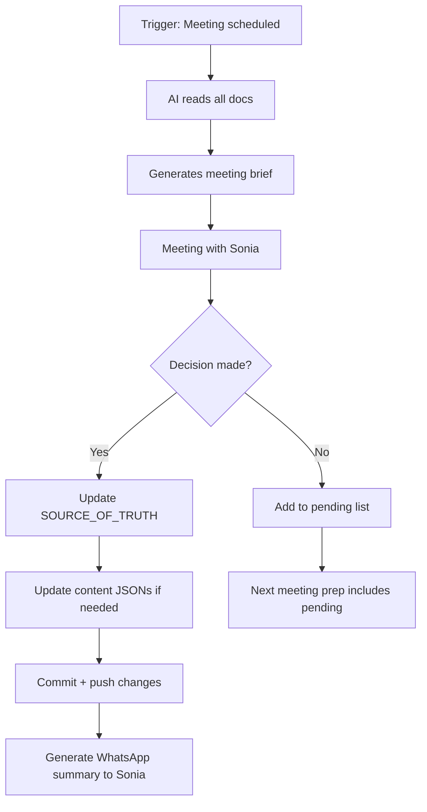

> **Deprecated pricing warning (2026-05-12):** This document contains pre-May-11 assumptions such as `$2,900/$4,400/$6,900` tiers. Current truth: one core `$1,500` service, private/internal unless Sonia approves publication. Read `docs/CURRENT_STATE.md` before using this document.

# Nexa Paraguay — AI Meeting System Design

> **Purpose:** Enable AI to talk with Sonia in Google Meets, work on the repo, and handle client meetings.
> **Architecture:** Existing Hermes Agent infrastructure + Google Meet + repo access
> **Status:** Design phase — ready to implement

---

## SYSTEM 1: AI ↔ SONIA MEETINGS (Weekly Sync, Ad-hoc)

### What the AI Does in These Meetings

| Meeting Type | Frequency | Duration | AI Role |
|-------------|-----------|----------|---------|
| Weekly sync | Weekly | 30 min | Present progress, ask decisions, take notes |
| Pricing review | One-time | 60 min | Resolve $1,500 vs $2,900 ambiguity |
| Content review | As needed | 30 min | Show site changes, get approval |
| Strategy session | Monthly | 45 min | Present data, recommend direction |

### What the AI Needs to Know Before Each Meeting

**1. Load context from repo:**
- `docs/SOURCE_OF_TRUTH.md` — current decisions
- `docs/pricing-matrix-complete.md` — pricing state
- `docs/01-client/meeting-may-11-questions.md` — questions and answers so far
- `docs/01-client/services-opportunities-matrix.md` — what's been built
- Git log of recent changes

**2. Prepare meeting brief (auto-generated):**
```
# Meeting Brief for [Date]
## Last meeting decisions:
- [decision 1]
- [decision 2]

## Pending decisions (need Sonia's input):
1. Price: $1,500 or $2,900?
2. Full story or PG version?
3. One service or packages?

## What was built since last meeting:
- 11 client tool HTMLs generated
- GA4 wired up
- Monthly retainers added

## Proposed for next week:
- Add 17 missing services (needs pricing)
- First-person rewrite (needs voice decision)
```

**3. During the meeting:**
- Listen for decisions → write to `docs/meeting-transcripts/YYYY-MM-DD.md`
- Update `SOURCE_OF_TRUTH.md` in real-time
- If Sonia says "change X" → make the change in the repo during the call
- Record action items

**4. After the meeting:**
- Commit all changes
- Generate action item list
- Update implementation plan status
- Send summary to Sonia via WhatsApp

### Implementation

**Hermes agent setup:**
```bash
# Agent profile for Sonia meetings
hermes profile create nexa-sonia-meeting \
  --model deepseek-chat \
  --context-window 128k \
  --tools repo-read,repo-write,gcal,whatsapp,speech-to-text

# One command to prep for meeting:
hermes run "nexa-sonia-prep" \
  --read "docs/SOURCE_OF_TRUTH.md" \
  --read "docs/01-client/meeting-may-11-questions.md" \
  --read "content/es.json" \
  --git-log "30" \
  --output "docs/meeting-brief.md"
```

---

## SYSTEM 2: AI ↔ CLIENT MEETINGS (Sales Calls)

### What the AI Does

| Phase | AI Role | Human (Sonia) Role |
|-------|---------|-------------------|
| Pre-call | Research prospect, prepare talking points | Reviews, adjusts |
| During call | Listen, take notes, suggest answers in real-time | Speaks, builds rapport |
| Post-call | Generate summary, create action plan, update CRM | Follows up personally |

### Pre-Call Intelligence Pack (auto-generated)

For each prospect, the AI prepares:
```
# Client Intelligence: [Name/Company]
## Profile
- Nationality: [NL/DE/BE/other]
- Profile type: [Freelancer/Investor/Family/Retiree]
- Key concern: [Tax/Bureaucracy/Safety/Schools]

## Suggested Talking Points
1. Your specific tax situation (if NL): Box 3 → 0% in PY
2. Timeline: 8-12 weeks, 1 trip
3. Schools: [client has kids? → St. Mary's / Goethe]

## Questions to Ask
1. What's your biggest concern about moving?
2. Do you have children? What ages?
3. What's your timeline?

## Sonia's Notes (from CRM)
[any prior conversations, emails]
```

### Call Script Generator

The AI generates Sonia's talking points based on the prospect profile:

**For a Dutch ZZP'er (most common profile):**
```
OPENING:
"Ik ben Sonia. Ik woonde 7 jaar in Nederland, dus ik weet precies wat je doormaakt."

KEY POINTS:
1. Belasting: 0% op buitenlands inkomen (was 49.5% in NL)
2. 1 reis, 8-12 weken, vaste prijs
3. "Acompañamiento casi familiar" — niet zomaar een kantoor

OBJECTION HANDLING:
"If cheaper: "Klopt, die $350 optie bestaat. Maar die begeleidt je niet naar de bank.
  Mijn netwerk opent deuren die een goedkope dienst niet heeft."

CLOSE:
"Plan een gratis gesprek van 30 minuten. Geen verplichtingen."
```

---

## SYSTEM 3: AI AGENT WORKING ON THE REPO

### What the AI Can Do Autonomously

| Task | Trigger | Approval Needed? |
|------|---------|-----------------|
| Generate client tools | On request | No |
| Update content JSONs | After Sonia decisions | Yes |
| Run Google Maps scraper | Schedule | No |
| Build/deploy site | On request | No |
| Generate meeting prep | Before meetings | No |
| Update implementation plan | After decisions | No |
| Send WhatsApp summary | After meetings | No |
| Research competitors | Weekly | No |

### Agent Workflow



---

## SYSTEM 4: CLIENT-FACING AI TOOLS

### 4.1 WhatsApp Lead Qualification Bot

**Current state:** WhatsApp bridge is configured but QR never scanned. Bot is dead.

**To activate:**
1. Sonia opens WhatsApp → Settings → Linked Devices
2. Scans QR from `public/qr-nexa-whatsapp.png`
3. Bot goes live: answers FAQ in 4 languages, collects contact info, books consult

**Bot flows by client type:**
```
NL CLIENT:
Bot: "Hallo! Ik ben de digitale assistent van Nexa Paraguay. 
      Hoe kan ik je helpen met je verhuizing naar Paraguay?"
Client: "Ik wil weten over belastingen."
Bot: "In Paraguay betaal je 0% belasting over buitenlands inkomen. 
      Wil je een gratis consult van 30 minuten met Sonia?"

CLIENT INTERESTED:
Bot: "Wat is je naam en e-mailadres? Sonia neemt binnen 24 uur contact met je op."
→ Data pushed to HubSpot CRM → Sonia gets notification
```

### 4.2 Document Pre-Validation Tool

Client uploads photos of documents → AI checks:
- Is the apostille present? (check for Hague convention seal)
- Is the translation into Spanish?
- Are all required documents present?
- Estimates the "document readiness score"

### 4.3 Automated Cost Calculator

Client enters (via website form):
- Family size
- Budget range
- Needs (residency only / company / property / schools)

→ AI generates personalized cost estimate PDF and emails to client
→ Captures lead in HubSpot

---

## INFRASTRUCTURE SETUP

### Google Meet Integration

```bash
# Required: Google Workspace API access for:
# 1. Create meeting links
# 2. Read calendar events
# 3. Transcribe meetings (optional)

# Set up service account:
gcloud iam service-accounts create nexa-meeting-bot
gcloud iam service-accounts keys create ~/.google/nexa-meeting-key.json

# Scopes needed:
# - https://www.googleapis.com/auth/calendar
# - https://www.googleapis.com/auth/meetings
```

### Repo Permissions

The AI agent needs:
- **Read:** All files in Nexa-Paraguay repo
- **Write:** `docs/`, `content/`, `nexa-pages/`
- **Execute:** `scripts/` (generate tools, run scraper)
- **No access:** `.env`, secrets

### Meeting Recording & Transcription

```python
# Proposed: Use Hermes speech-to-text or Google Cloud Speech-to-Text
# Transcribe meeting → extract decisions → update repo

# Pseudocode:
def process_meeting_recording(audio_file):
    transcript = speech_to_text(audio_file, language='nl')  # Sonia speaks NL
    decisions = extract_decisions(transcript)
    for decision in decisions:
        update_source_of_truth(decision)
        if decision.affects_content:
            update_content_json(decision)
    generate_summary(transcript, decisions)
    send_whatsapp(SONIA_NUMBER, summary)
```

---

## IMPLEMENTATION CHECKLIST

### Week 1: Foundation
- [ ] Add Hermes agent profile for Sonia meetings
- [ ] Set up Google Meet API access
- [ ] Build meeting prep generator script
- [ ] Create meeting transcript parser

### Week 2: Client Tools
- [ ] Activate WhatsApp bot (scan QR — 1 minute!)
- [ ] Build document pre-validation tool
- [ ] Build automated cost calculator

### Week 3: Integration
- [ ] Connect HubSpot CRM to WhatsApp bot
- [ ] Set up automated nurture sequences
- [ ] Create predictive property matching

### Ongoing
- [ ] Run AI weekly syncs with Sonia
- [ ] Continuously improve meeting prep
- [ ] Expand AI capabilities based on feedback

---

## MEETING AGENDAS

### First AI ↔ Sonia Meeting (1 hour)

| Minute | Topic | AI Prep |
|--------|-------|---------|
| 0-5 | Intro: What this AI can do | Show meeting prep doc |
| 5-15 | Show all 11 client tools | Open HTML files in browser |
| 15-25 | Show site changes | Walk through localhost:3000 |
| 25-35 | **Must decide: Pricing** | Present $1,500 vs $2,900 analysis |
| 35-40 | **Must decide: Story version** | Present both options on About page |
| 40-45 | **Must decide: Voice** | Show first-person vs third-person examples |
| 45-50 | **Must decide: Ideal client** | Show 5 personas, ask which to target |
| 50-55 | WhatsApp QR scan | Do it live — takes 1 minute |
| 55-60 | Next steps | Commit decisions, schedule next meeting |

### Weekly AI ↔ Sonia Sync (30 min)

| Minute | What |
|--------|------|
| 0-5 | What was built this week (show it) |
| 5-15 | Show 1-2 pending decisions, ask for answers |
| 15-20 | Plan next week's work |
| 20-25 | Show analytics (GA4, leads if WhatsApp active) |
| 25-30 | Any questions from Sonia? |

### AI-Assisted Client Call Flow

```
Pre-call: AI sends Sonia the client pack (10 min before)
During call: AI listens, suggests responses
Post-call: AI sends follow-up email to client + updates CRM
```


